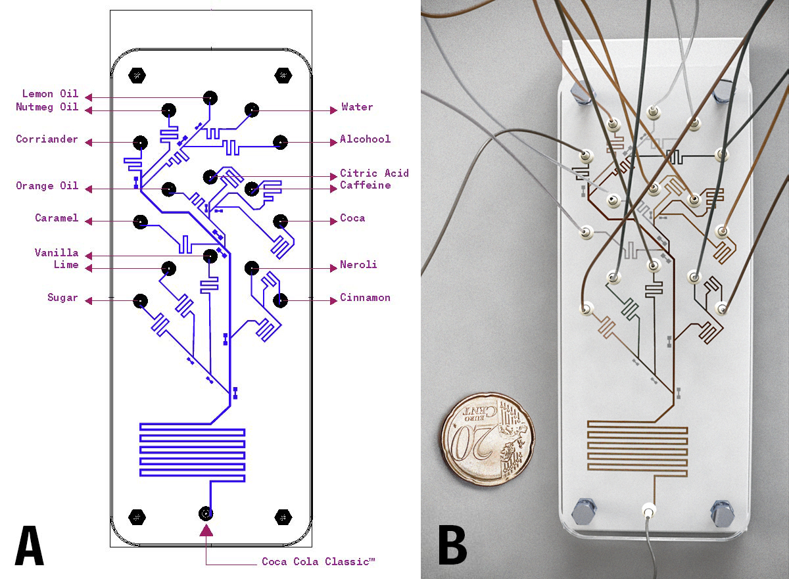

Materials and Methods
---------------------

### Experimental Design

We settled on High Performance Liquid Chromatography (HPLC) for its
flexibility at this exploratory stage in the research. Compatibility was
a key constraint as our setup included a de-gassing system for 3 inputs
(Coca-Cola Classic, Fanta Orange and Sprite) and a pellet solution for 1
input (MSG). Solutions were then pumped into microfluidic lab-on-chip
devices for separation, resulting in 43 different compound feeds. These
were all connected to a multichannel peptide synthesizer for re-assemby
into the final output. Synthesis instructions were compiled by the FML
parser and transmitted to the synthesizer synchronously using our SODA
Streaming API.

**Fig. 4 Experimental Design**
 **A:** HPLC Rack with 4 input banks Bank C: Coca-Cola Classic™ (liquid)
Bank F: Fanta Orange™ (liquid) Bank S: Sprite™ (liquid) Bank M:
Monosodium Glutamate (solid/pellet) **B:** Syringe Pump. Accuracy of
±0.5%, max. flow: 0.5ul **C:** Microfuidic Chip Separators **D:** Gama
Inc. Soprano™ Peptide Synthesizer **E:** Multi-pipette with inlet
valve - capacity: 50ml

### Microfuidic Lab-On-Chip Separator

**Fig. 5 Lab-On-Chip Microchannel design**
 Showing separation pathways for Coca-Cola Classic into its 15 basic
components[12](#fn:12) **A:** Circuit Design **B:**
Photograph showing micro channel etching and separations.

### Flavor Markup Language (FML)

FML is a fully defined XML data description standard designed for the
exchange of CFS(m) recipes. It is designed as an open standard and as a
subset of Extensible Markup Language (XML). FML defines a set of rules
for encoding documents in a format that is both human-readable and
machine-readable. A working data structure (fig. 6) was used for the
purpose of this study while the full schema definition is being drafted
by the team.

Please see example files in the [FML directory](../FML/)

    FML File
     |– Author
     |  |- Name
     |  |- Email
     |
     |- Recipe
        |- Title
        |- Date Created
        |- Date Modified
        |- Version
        |- Notes
        |- Unit declarations
        |- Source (C,F,S or m)
           |- Compounds
              |- Esters

**Fig. 6** FML Data Structure - see [example file](../FML/example.fml.xml)

### Blind Tests

The success of CFS(m) flavor replication was assessed using randomized
blind tests. These were conducted for 3 case studies, using a random
sample of 10 convenience foods consumers. The subjects were identified
in supermarket aisles and chosen for their familiarity with the product
being tested. Informed consent was obtained before any studies were
carried out.

For optimal taste sensitivity, subjects were tested in the fasting
state. Smokers were asked not to smoke for the 2 hours prior to taste
testing. Water was allowed up to the time of
testing[13](#fn:13). Taste testing was done by using the
three drop stimulus technique[14](#fn:14): one drop of flavor
extract from the target product, one drop of water (placebo) and one
drop of CFS(m) test solution. The 3 drops were presented in a varied
order in a mixed design[15](#fn:15).

Blind taste tests were conducted for each case study. After each
stimulus, subjects were asked to name, if any was recognized, the
product they were tasting. Flavor profiles were characterized by asking
subject to grade the strength of 5 characteristics: sweetness, acidity,
saltiness, bitterness and richness/umami on a scale of 0 to 10.