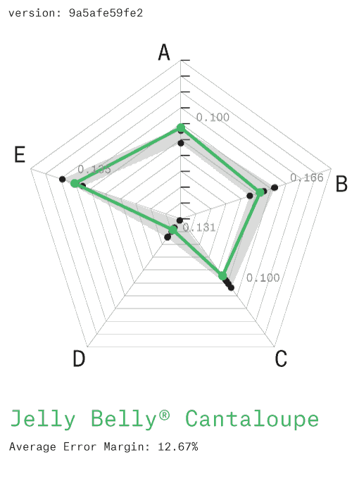
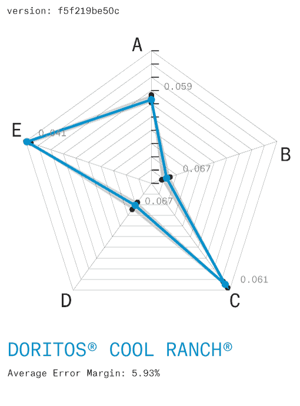
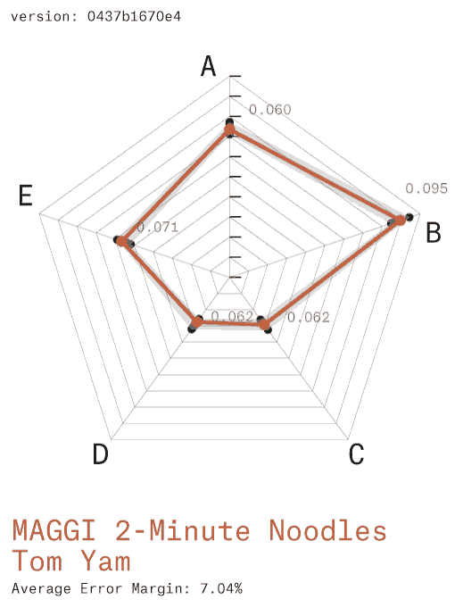

Results
-------

Three products (Jelly Belly Cantaloupe, Doritos Cool Ranch and Maggi
2-Minute Noodles Tom Yam) were chosen as case studies for their
popularity and diversity. We flavor-profiled them using a static
headspace GC-MS method[16](#fn:16). The resulting target
profiles were then replicated in FML (see full recipes in the
[FML](FML/) appendix) and synthesized using our experimental CFS(m)
workflow.

Our syntheized results were then compared to the original target
profiles following our blind test protocol. Results were plotted as
radar graphs (fig. 7) showing the target flavor profile against the
error margin defined by blind test results. This showed that CFS(m)
replicas were indistiguishable from their target profiles by flavor
industry standards.

**1**
**2**
**3**

**Fig. 7** Blind Test results: Flavor Profile matching
 3 case studies: **1:** Jelly Belly Cantaloupe **2:** Doritos Cool Ranch
**3:** MAGGI 2-Minute Noodles Tom Yam. Flavor profiles are shown as
**A:** Sweetness, **B:** Acidity, **C:** Saltiness, **D:** Bitterness
and **E:** Richness/Umami.

Conclusions
-----------

The methods and protocols developed in this study demonstrate that
flavor can be replicated in a quantitative and systematic
manner[17](#fn:17) through a modular computational approach.
This lays the foundations for a paradigm shift in flavor synthesis.

Our experiments confirm the hypothesis that Coca-Cola Company's
Coca-Cola Classic™, Fanta Orange™ and Sprite™, with the addition of
Monosodium Glutamate (MSG), can be broken down into their basic
components and re-combined to form an ester palette from which every
flavor in the world can be recreated. Analogies to color theory's
additive (RGB) or substractive (CMYK) color
spaces[18](#fn:18) suggest that flavor synthesis may have
found, at long last, its primary colors in the form of CFS(m). Such a
flavor system has the potential to increase the efficiency of our
industry by several orders of magnitude, while maintaining an acceptable
degree of flavor diversity.

The variety of digital color models currently in operation for specific
purposes (eg. RGB, HSV, Hexadecimal, RAL, Pantone™, etc) highlight the
potential for standardisation and replicability across global networks
of suppliers, industries and consumers. Our methods demonstrate that the
FML file format provides a robust data structure for flavor semantics
while remaining fairly readable. We are confident that it will encourage
further research from the community that will expand the scope of
characterized CFS(m) flavor space.

Furthermore, our system builds on off-the-shelf ingredients which makes
it compliant by default with existing regulations. This will transform
long-winded and costly regulatory approval processes into mere
formalities and allow researchers to focus on (re)creating great
flavors. The adoption of CFS(m) as a standard by the wider flavor
community will enable a new era for flavor synthesis, where any flavor
in the world can be easily reproduced and manipulated.