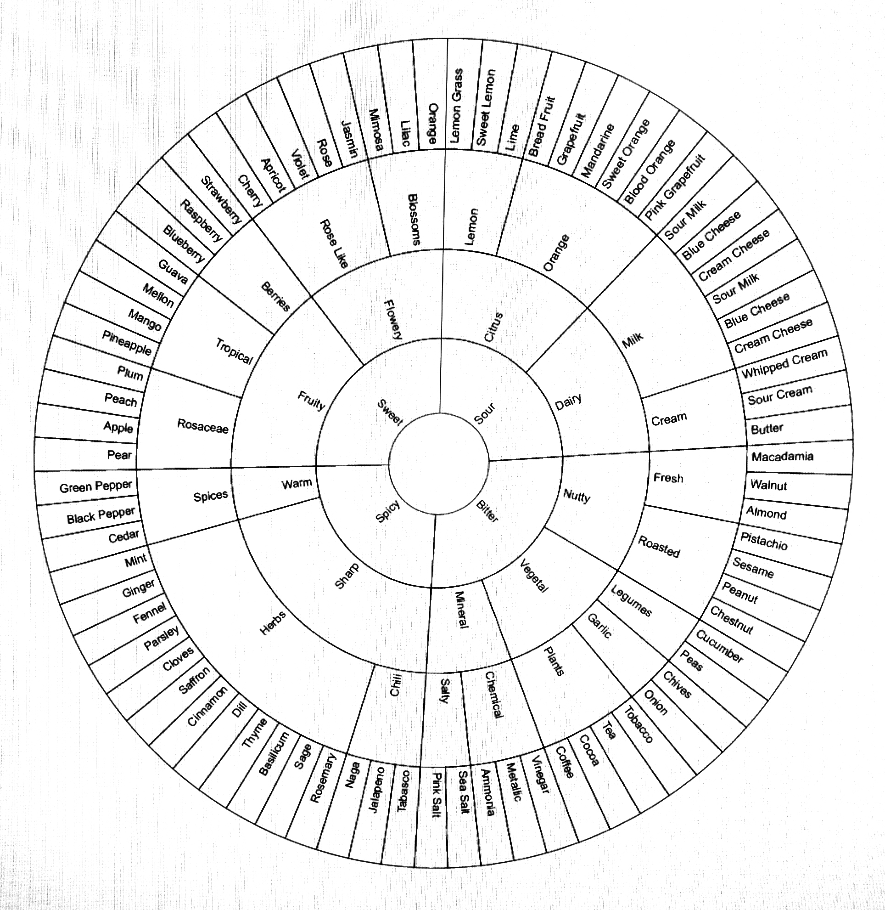
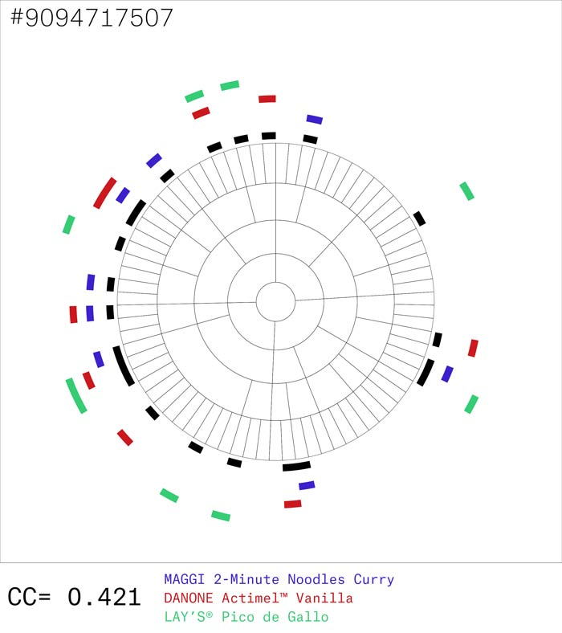
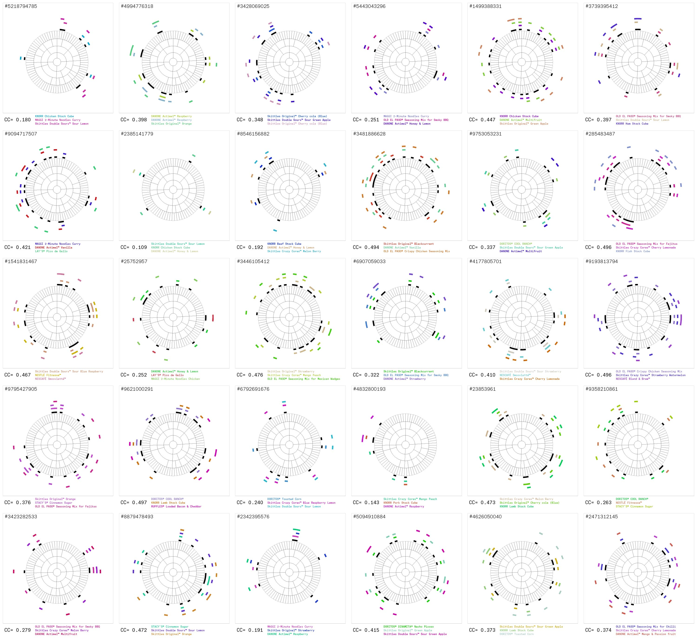
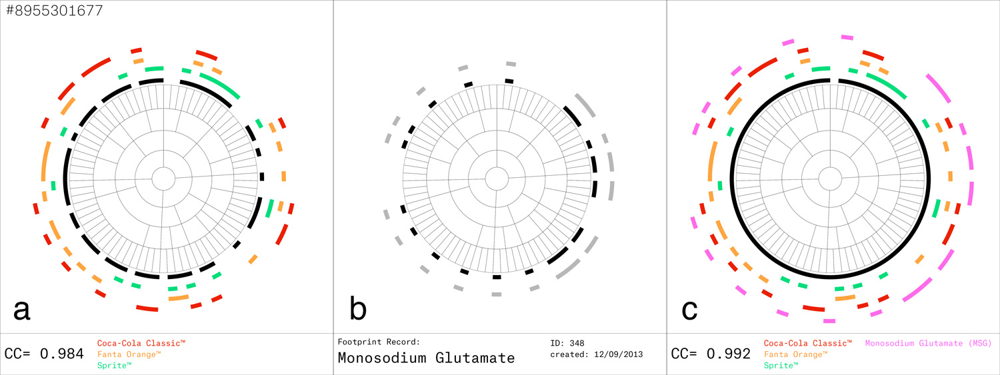
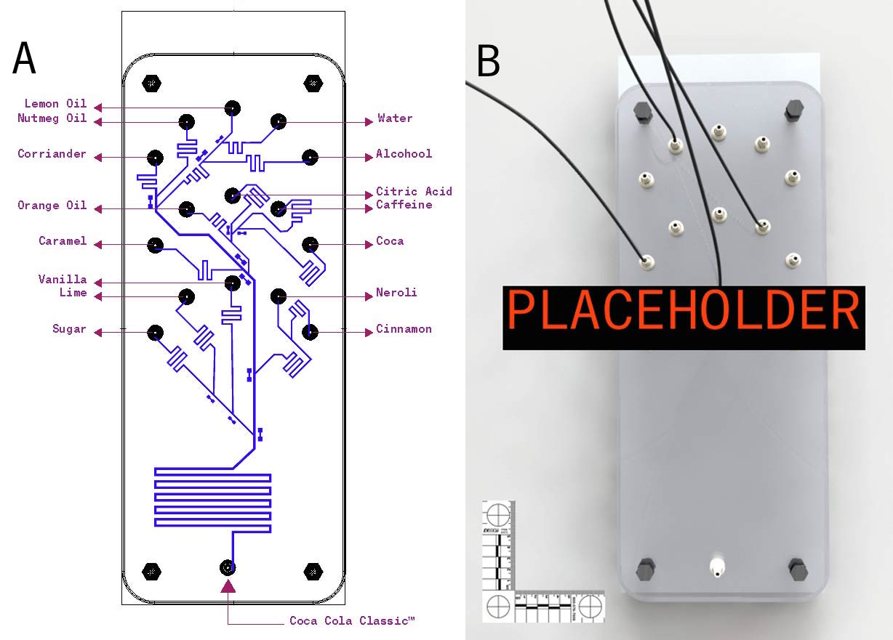
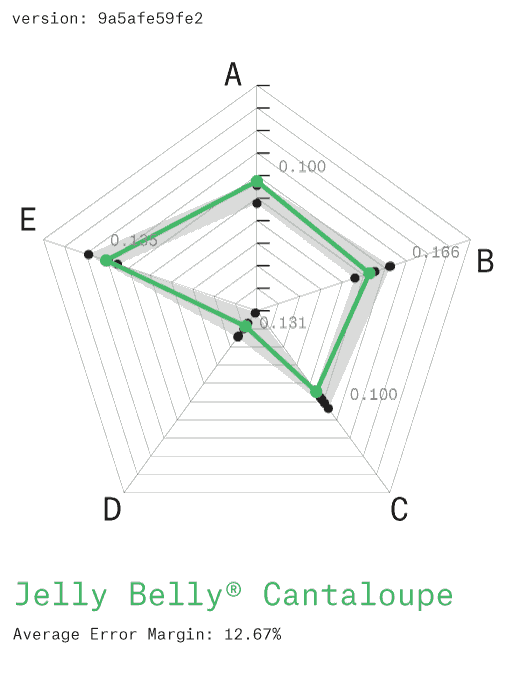
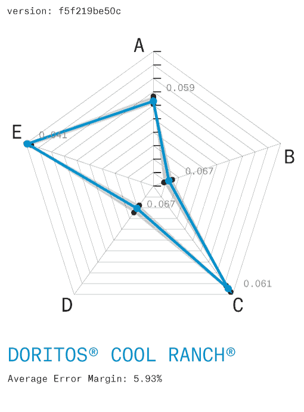
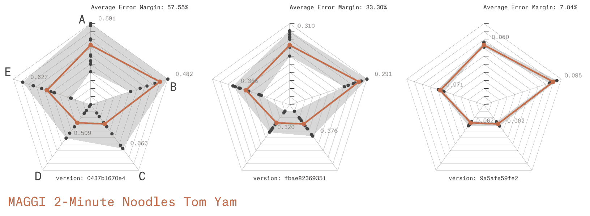

# CFS(m): universal paradigm for computational flavor synthesis.

Lanza T. [^1] and Benque D. [^2]

[^1]: Lanza Affiliation
[^2]: Benque Affiliation 

## Abstract
We disclose an experimental apparatus and novel methods for ester synthesis in artificial flavour production using off-the-shelf ingredients. This new approach is the direct if serendipitous outcome of our ongoing research in flavor mapping using mass-spectrometry on convenience foods. We detail preliminary findings and experimental design, as well as a framework to build on these findings using two key components: the Flavor Markup Language (FML) and Synchronous On-Demand Aroma (SODA) Streaming API. On this basis we propose a new universal and distributed paradigm for computational [^8] flavour synthesis.

## Introduction
The analysis and classification of flavors along a continuous spectrum[^4] has long been a key challenge for both food science and industry. Ester chain optimisation has made rapid progress in the last decade but some hurdles remain–a coherent systems approach still falls short of unifying niche areas such as coffee flavour [^6]. Consumer "clean label" [^5] concerns are placing existing systems under increasing pressure.

In this setting, our initial research was concerned with flavor mapping following a network-based approach [^7] and focusing on convenience foods [^9]. A typical study would use High Performance Liquid Chromatography (HPLC) to separate off-the-shelf products  into their constituent components. The resulting fraction pool would then be quantified [^10] and modelled computationally [^11] to generate correlation analysis reports (fig. 2) between a pool of up to 4 products and the full flavour spectrum (fig. 1). Such results are used to optimise production systems by 1) Reducing costs across multiple product outputs. 2) Maximising the use of waste fractions into new outputs. 



**Fig. 1 Flavor Spectrum**  
>> needs source

<div style="clear:both"></div>

 **A**

 **B**

**Fig. 2 Flavor Correlation Chart**  
**A.** Computational model output showing Correlation Coefficient (CC) for a given triple. **B.** contact sheet  
[See full dataset](figures/Correlation-Reports) 


One recent study involved a top-tier market sample of 52 products on which we were running our established series of analysis methods. The sample pool was a median cross section of "shopping basket"[^12] items, so nothing prepared us for the remarkable results that our models delivered. 

We were using a Correlation Coefficient variable between 0.0 and 1.0 as a proxy for mapping multi-dimensional flavor space, with 1.0 as the hypoethical perfect match with the full flavor spectrum. We routinely witnessed correlation coefficients up to a maximum of 0.54, however a specific sample of 3 products yielded a score of 0.95, meaning the pool of their components almost covered the entire flavour space. 

We isolated the 3 products (Coca-Cola Company's Coca-Cola Classic™, Fanta Orange™ and Sprite™) and were able to reproduce coefficients between 0.94 and 0.96 in subsequent experiments. Checking the spectrum footprint against our existing databases revealed that the missing 0.06 to 0.04 could be closed significantly with the addition of a fourth source: Monosodium Glutamate (MSG)[^13]. The resulting pool (further referred to as CFS(m)) was ranked at up to 0.984 correlation coefficient by our model (fig. 3). Given the 0.15 error margin generally accepted by the flavour industry this is equivalent to a confident match with the full flavour spectrum.



**Fig. 3 The CFS(m) Correlation**    
**3.a.** Initial Correlation result of the CFS sample: Coca-Cola Company's Coca-Cola Classic™, Fanta Orange™ and Sprite™ against the flavour spectrum **3.b.** Footprint Record for Monosodium Glutamate (MSG). **3.c.** Combined CFS(m) Correlation showing a coefficient of 0.992

On the basis of this exceptional and unexpected match and computational proof, we designed an initial wet-lab study to test the hypothesis chemically, the results of which are detailed here. Our aim was primarily to test the viability of CFS(m) in reproducing a range of flavors from our convenience foods database and, should this be successful, to establish protocols for the systematisation of CFS(m) synthesis for further experimentation, reproducibility and characterization. 


## Materials and Methods

### Experimental Design 

>> Describe process here  
>> de-gasing
>> Fischer–Speier esterification


**Fig. 4 Experimental Design**  
**A:** High Performance Liquid Chromatography (HPLC) 4 bank rack **B:** Bank C: Coca-Cola Classic™ (liquid) **C:** Bank F: Fanta Orange™ (liquid) **D:** Bank S: Sprite™ (liquid) **E:** Bank M: Monosodium Glutamate (solid) **F:** Syringe Pump. Accuracy of ±0.5% and reproducibility of ±0.05% - max. flow: 0.5ul **G:** Microfuidic Chip Separators **H:** Find a name for this **I:** Multi-pipette - capacity: xxml

### Microfuidic Lab-On-Chip Separator

>> Describe chip design, flows, etc here



**Fig. 5 Lab-On-Chip Microchannel design**  
descritption here [^14] **A:** Circuit Design **B:** Photograph showing micro channel etching (not yet!) 

<div style="clear:both"></div>

### Flavor Markup Language (FML)

Describe FML spec.   
format, syntax, etc... should be taken from any other XML spec  
[Link to FML directory](FML/)

```
FML File
 |– Author
 |  |- Name
 |  |- Email
 |
 |- Recipe
    |- Title
    |- Date Created
    |- Date Modified 
    |- Version
    |- Notes
    |- Unit declarations
    |- Source (C,F,S or m)
       |- Compounds
          |- Esters
```

**Fig. 6** FML tree - see [example file](FML/example.fml.xml)


>> SODA Streaming API descriptions here 


### Re-Assembly
>> describe how the flavour-components are put back together!!

### Blind Tests
The exactitude of CFS(m) flavor replicas was refined through an iterative process, using randomized blind tests as an assessment method. These were conducted for 3 case studies, using a random sample of 10 convenience foods consumers. The subjects were identified in supermarket aisles and chosen for their familiarity with the product being tested. Informed consent was obtained before any studies were carried out.

For optimal taste sensitivity, subjects were tested in the fasting state. Smokers were asked not to smoke for the 2 hours prior to taste testing. Water was allowed up to the time of testing[^15]. Taste testing was done by using the three drop stimulus technique[^16]: one drop of flavor extract from the target product, one drop of water (placebo) and one drop of CFS(m) test solution. The 3 drops were presented in a varied order in a mixed design[^15].

For each case study, flavor blind tests were conducted on three non-consecutive days, giving the team time to adjust teh CFS(m) models and produce new FML recipes to be tested in the next wave. After each stimulus, subjects were asked to name, if any was recognised, the product they were tasting. Flavor profiles were characterised by asking subject to grade the strength of 5 characteristics: Sweetness, Acidity, Saltiness, Bitterness and Richness/Umami on a scale of 0 to 10. Results were plotted as radar graphs (fig. 7) showing the target flavor profile against the error margin defined by blind test results. An optimal process of 3 iterations was identified as consistently yielding the most efficient reduction of the error margin.  

## Results

  
**1**
  
**2**
  
**3**

**Fig. 7** Blind Test results: Iterative Flavor Profile matching  
3 case studies: **1:** Jelly Belly® Cantaloupe **2:** DORITOS® COOL RANCH® **3:** MAGGI 2-Minute Noodles Tom Yam. The triple iterative process is demonstrated as weel as efficient reductions of error margins. Flavor profiles are shown as **A:** Sweetness, **B:** Acidity, **C:** Saltiness, **D:** Bitterness and **E:** Richness/Umami.

## Conclusions
The methods and protocols developed in this study demonstrate that flavor can be replicated in a quantitative and systematic manner[^17] though a modular computational approach. This lays the foundations for a paradigm shift in flavor synthesis.

Our experiments confirm the hypothesis that Coca-Cola Company's Coca-Cola Classic™, Fanta Orange™ and Sprite™, with the addition of Monosodium Glutamate (MSG), are the primary components of an ester palette from which every flavor in the world can be recreated. Analogies to color theory's additive (RGB) or substractive (CMYK) color spaces[^18], suggest that a CFS(m) flavor system could increase the efficiency of flavor synthesis by several orders of magnitude. The variety of digital color models currently in operation for specific purposes (eg. RGB, HSV, Hexadecimal, RAL, Pantone™, etc) highlight the potential for standardisation and replicability across global networks of suppliers, industries and consumers. 

Our iterative testing methods show that the FML file format provides a robust data structure for flavor semantics while remainging fairly readable. We hope it will encourage further research from the community that will expand the scope of characterised CFS(m) flavor space. 


## References

[^4]: MATTHEWS, J. S., SUGISAWA, H. and MAC GREGOR, D. R. (1962), The Flavor Spectrum of Apple-Wine Volatiles. *Journal of Food Science*, 27: 355–362.
[^5]: Zink, D. L. (1997). The impact of consumer demands and trends on food processing. *Emerging Infectious Diseases*, 3(4), 467.
[^6]:Shibamoto, T. (1991). An overview of coffee aroma and flavor chemistry. In *Quatorzieme colloque scientifique international sur le cafe*, San Francisco, 14-19 juillet 1991. (pp. 107-116).
[^7]: Ahn, Y. Y., Ahnert, S. E., Bagrow, J. P., & Barabási, A. L. (2011). Flavor network and the principles of food pairing. *Scientific reports*, 1.
[^8]: Network analysis and data mining in food science: the emergence of computational gastronomy DOI 10.1186/2044-7248-2-4
[^9]: Verlegh, P. W., & Candel, M. J. (1999). The consumption of convenience foods: reference groups and eating situations. *Food Quality and Preference*, 10(6), 457-464.
[^10]: Caballero-Ortega, H., Pereda-Miranda, R., & Abdullaev, F. I. (2007). HPLC quantification of major active components from 11 different saffron (Crocus sativus L.) sources. *Food Chemistry*, 100(3), 1126-1131.
[^11]: Bhat, N. V., Minderman Jr, P. A., McAvoy, T., & Wang, N. S. (1990). Modeling chemical process systems via neural computation. *Control Systems Magazine*, IEEE, 10(3), 24-30.
[^12]: Manchanda, P., Ansari, A., & Gupta, S. (1999). The “shopping basket”: A model for multicategory purchase incidence decisions. *Marketing Science*, 18(2), 95-114.
[^13]: [http://pubchem.ncbi.nlm.nih.gov/compound/23672308](http://pubchem.ncbi.nlm.nih.gov/compound/23672308)
[^14]: [http://www.thisamericanlife.org/radio-archives/episode/427/original-recipe/recipe](http://www.thisamericanlife.org/radio-archives/episode/427/original-recipe/recipe)
[^15]:Mahajan, S. K., Prasad, A. S., Lambujon, J., Abbasi, A. A., Briggs, W. A., & McDonald, F. D. (1980). Improvement of uremic hypogeusia by zinc: a double-blind study. *The American journal of clinical nutrition*, 33(7), 1517-1521.
[^16]:Henkin, R. I., Gill Jr, J. R., & Bartter, F. C. (1963). Studies on taste thresholds in normal man and in patients with adrenal cortical insufficiency: the role of adrenal cortical steroids and of serum sodium concentration. *Journal of Clinical Investigation*, 42(5), 727.
[^17]:HENKIN, R. I., SCHECTER, P. J., FRIEDEWALD, W. T., DEMETS, D. L., & RAFF, M. (1976). A double blind study of the effects of zinc sulfate on taste and smell dysfunction. *The American journal of the medical sciences*, 272(3), 285-299.
[^18]: Newton, I. (1704). *Opticks: or a treatise of the reflexions, refractions, inflexions and colours of light.*