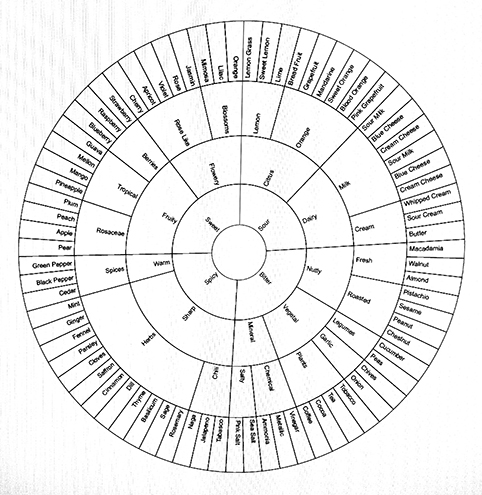

# CFS(m): universal paradigm for computational flavor synthesis.

Lanza T. [^1] and Benque D. [^2]

## Abstract
We disclose an experimental apparatus and novel methods for ester synthesis in artificial flavour production using off-the-shelf ingredients. This new approach is the direct if serendipitous outcome of our ongoing research in flavor mapping using mass-spectrometry on convenience foods. We detail preliminary findings and experimental design, as well as a framework to build on these findings using two key components: the Flavor Markup Language (FML) and Synchronous On-Demand Aroma (SODA) Streaming API. On this basis we propose a new universal and distributed paradigm for computational [^8] flavour synthesis.

## Introduction
The analysis and classification of flavors along a continuous spectrum [^4] has long been a key challenge for both food science and industry. Ester chain optimisation has made rapid progress in the last decade but some hurdles remain–a coherent systems approach still falls short of unifying niche areas such as coffee flavour [^6]. Consumer "clean label" [^5] concerns are placing existing systems under increasing pressure.

In this setting, our initial research was concerned with flavor mapping following a network-based approach [^7] and focusing on convenience foods [^9]. A typical study would use High Performance Liquid Chromatography (HPLC) to separate off-the-shelf products  into their constituent components. The resulting fraction pool would then be quantified [^10] and modelled computationally [^11] to generate correlation analysis reports (fig. 2) between a pool of up to 4 products and the full flavour spectrum (fig. 1). Such results are used to optimise production systems by 1) Reducing costs across multiple product outputs. 2) Maximising the use of waste fractions into new outputs. 



**Fig. 1 Flavor Spectrum**  
[needs source]

<div style="clear:both"></div>

 **A**

 **B**

**Fig. 2 Flavor Correlation Chart**  
**A.** Computational model output showing Correlation Coefficient (CC) for a given triple. **B.** contact sheet  
[See full dataset](figures/Correlation-Reports) 


One recent study involved a top-tier market sample of 52 products on which we were running our established series of analysis methods. The sample pool was a median cross section of "shopping basket"[^12] items, so nothing prepared us for the remarkable results that our models delivered. Whereas we routinely witnessed correlation coefficients up to a maximum of 0.54, a specific sample of 3 products yielded a score of 0.95, meaning the pool of their components almost covered the entire flavour spectrum. We isolated the 3 products (Coca-Cola Company's Coca-Cola Classic™, Fanta Orange™ and Sprite™) and were able to reproduce coefficients between 0.94 and 0.96 in subsequent experiments. Checking the spectrum footprint against our existing databases revealed that the missing 0.06 to 0.04 could be closed significantly with the addition of a fourth source: Monosodium Glutamate (MSG)[^13]. The resulting pool (further referred to as CFS(m)) was ranked at up to 0.984 correlation coefficient by our model (fig. 3). Given the 0.15 error margin generally accepted by the flavour industry this is equivalent to a confident match with the full flavour spectrum.


**Fig. 3 The CFS(m) Correlation**    
**3.a.** Initial Correlation result of the CFS sample: Coca-Cola Company's Coca-Cola Classic™, Fanta Orange™ and Sprite™ against the flavour spectrum **3.b.** Footprint Record for Monosodium Glutamate (MSG). **3.c.** Combined CFS(m) Correlation showing a coefficient of 0.992


On the basis of this exceptional and unexpected match and computational proof, we designed an initial wet-lab study to test the hypothesis chemically, the results of which are detailed here. Our aim was primarily to test the viability of CFS(m) in reproducing a range of flavors from our convenience foods database and, should this be successful, to establish protocols for the systematisation of CFS(m) synthesis for further experimentation, reproducibility and characterization. 


## Materials and Methods

### Experimental Design 

Describe process here  
Fischer–Speier esterification


**Fig. 4 Experimental Design**  
**A:** High Performance Liquid Chromatography (HPLC) machine? de-gasing **B:** Bank C: Coca-Cola Classic™ (liquid) **C:** Bank F: Fanta Orange™ (liquid) **D:** Bank S: Sprite™ (liquid) **E:** Bank M: Monosodium Glutamate (solid) **F:** Syringe Pump. Accuracy of ±0.5% and reproducibility of ±0.05% - max. flow: 0.5ul **G:** Microfuidic Chip Separators **H:** Find a name for this **I:** Multi-pipette - capacity: xxml

### Microfuidic Lab-On-Chip Separator

Describe chip design, flows, etc here


**Fig. 5 Lab-On-Chip Microchannel design**  
descritption here [^14] **A:** Circuit Design **B:** Photograph showing micro channel etching (not yet!) 


<div style="clear:both"></div>

>> ADD RENDER OF LAB ON CHIP CLOSE-UP?

### Flavor Markup Language (FML)

Describe FML spec.   
format, syntax, etc... should be taken from any other XML spec  
[Link to FML directory](FML/)

```
FML File
 |– Author
 |  |- Name
 |  |- Email
 |
 |- Recipe
    |- Title
    |- Date Created
    |- Date Modified 
    |- Version
    |- Notes
    |- Unit declarations
    |- Source (C,F,S or m)
       |- Compounds
          |- Esters

```

**Fig. 6** FML tree

```
<?xml version="1.0" encoding="UTF-8"?>
<FML version="0.3.1" xmlns="http://www.theworkers.net/FML">
 <author>
   <name>David Benque</name>
   <email></email>
 </author>
 <recipe>
   <title>Jelly Belly - Cocktail Classics - Pomegranate Cosmo</title>
   <created>2015-05-03T15:21:00Z</created>
   <modified>2015-05-09T21:43:54Z</modified>
   <version>2.2</version>
   <notes>My first CFS(m) Flavor!</notes>
   <units orientation="0.63513, 0.96112, 0.40701" type="nl" vector="0.73"/>
 <source bank="C" flow="continuous" mBar="0.46">
   <compounds>
     <ester CID="Compound(7997)" description="pear" name="Propyl acetate">QTY: 0.000</ester>
   </compounds>
 </source>
 <source bank="F" flow="continuous" mBar="0.31">
   <compounds>
     <ester CID="Compound(8164)" description="fruity-orange" name="Octyl acetate">QTY: 19.283</ester>
     <ester CID="Compound(6448)" description="pine" name="Bornyl acetate">QTY: 0.000</ester>
   </compounds>
 </source>
 <source bank="S" flow="continuous" mBar="0.10">
   <compounds>
     <ester CID="Compound(8025)" description="lemon, rum, strawberry" name="Ethyl formate">QTY: 28.510</ester>
   </compounds>
 </source>
 <source bank="M" flow="inter" mBar="0.03">QTY: 0.35</source>
</recipe>
</FML>
```
**Fig. 7** Sample FML recipe - [source file](FML/example.fml.xml)

>> SODA Streaming API descriptions here 

### Re-Assembly
>> describe how the flavour-components are put back together!!

### Blind Tests
>> Each CFS output was tested in a blind test alongside the original (eg. DORRITOS Cool American). Describe standard taste testing procedure here. 


## Results

>> which tastes were replicated? 2 FML files use Jelly Belly flavors

>> Table of results per ester

Blind Test results:


## Conclusions

>> Modular systems CMYK, RGB: **CFS is the RGB of Flavor**  
>> CFS(m) Could be extended to all flavors, further experimentation. FML Library?   
>> question "clean Label" aspirations? 

## References

[^1]: Lanza Affiliation
[^2]: Benque Affiliation 
[^4]: MATTHEWS, J. S., SUGISAWA, H. and MAC GREGOR, D. R. (1962), The Flavor Spectrum of Apple-Wine Volatiles. *Journal of Food Science*, 27: 355–362.
[^5]: Zink, D. L. (1997). The impact of consumer demands and trends on food processing. *Emerging Infectious Diseases*, 3(4), 467.
[^6]:Shibamoto, T. (1991). An overview of coffee aroma and flavor chemistry. In *Quatorzieme colloque scientifique international sur le cafe*, San Francisco, 14-19 juillet 1991. (pp. 107-116).
[^7]: Ahn, Y. Y., Ahnert, S. E., Bagrow, J. P., & Barabási, A. L. (2011). Flavor network and the principles of food pairing. *Scientific reports*, 1.
[^8]: Network analysis and data mining in food science: the emergence of computational gastronomy DOI 10.1186/2044-7248-2-4
[^9]: Verlegh, P. W., & Candel, M. J. (1999). The consumption of convenience foods: reference groups and eating situations. *Food Quality and Preference*, 10(6), 457-464.
[^10]: Caballero-Ortega, H., Pereda-Miranda, R., & Abdullaev, F. I. (2007). HPLC quantification of major active components from 11 different saffron (Crocus sativus L.) sources. *Food Chemistry*, 100(3), 1126-1131.
[^11]: Bhat, N. V., Minderman Jr, P. A., McAvoy, T., & Wang, N. S. (1990). Modeling chemical process systems via neural computation. *Control Systems Magazine*, IEEE, 10(3), 24-30.
[^12]: Manchanda, P., Ansari, A., & Gupta, S. (1999). The “shopping basket”: A model for multicategory purchase incidence decisions. *Marketing Science*, 18(2), 95-114.
[^13]: [http://pubchem.ncbi.nlm.nih.gov/compound/23672308](http://pubchem.ncbi.nlm.nih.gov/compound/23672308)
[^14]: [http://www.thisamericanlife.org/radio-archives/episode/427/original-recipe/recipe](http://www.thisamericanlife.org/radio-archives/episode/427/original-recipe/recipe)