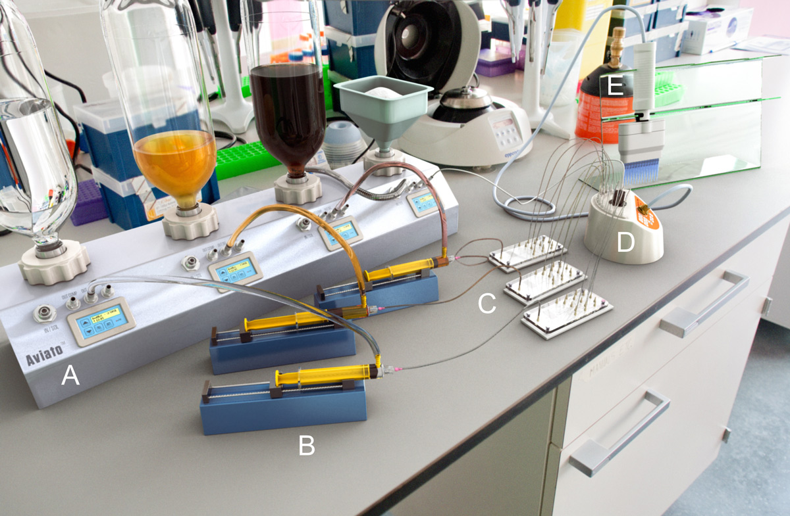
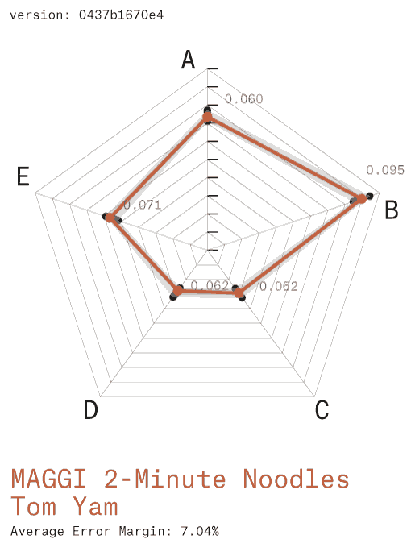

CFS(m): universal paradigm for computational flavor synthesis.
==============================================================

Lanza T.1 and Benque D.2

1: Lanza affiliation 2: Benque affiliation

Abstract
--------

We disclose an experimental apparatus and novel methods for ester
synthesis in artificial flavor production using off-the-shelf
ingredients. This new approach is the direct outcome of our ongoing
research in flavor mapping using mass spectrometry on convenience foods.
We detail preliminary findings and experimental design, as well as a
framework to build on these findings using two key innovations: the
Flavor Markup Language (FML) and Synchronous On-Demand Aroma (SODA)
Streaming API. On this basis we propose a new universal and distributed
paradigm for computational [1](#fn:1) flavor synthesis.

Introduction
------------

The analysis and classification of flavors along a continuous
spectrum[2](#fn:2) has long been a key challenge for both
food science and industry. Ester chain optimisation has made rapid
progress in the last decade but some hurdles remain–a coherent systems
approach still falls short of unifying niche areas such as coffee
flavor[3](#fn:3). Consumer "clean label"[4](#fn:4)
concerns are also placing existing systems under increasing pressure.

In this setting, our initial research was concerned with flavor mapping
following a network-based approach[5](#fn:5) and focusing on
convenience foods[6](#fn:6). A typical study would use High
Performance Liquid Chromatography (HPLC) to separate off-the-shelf
products into their constituent components. The resulting fraction pool
would then be quantified[7](#fn:7) and modelled
computationally[8](#fn:8) to generate correlation analysis
reports (fig. 2) between a pool of up to 4 products and the full flavor
spectrum (fig. 1). Such results are typically commissioned and used to
optimise production systems by 1) Reducing costs across multiple product
outputs. 2) Maximising the use of waste fractions into new outputs.

 **Fig. 1 Flavor Spectrum**
 Linear classification of flavors[9](#fn:9)

 **A**
 **Fig. 2 Flavor Correlation Chart**
 **A.** Computational model output exemplar showing Correlation
Coefficient (CC) for a given triple. **B.** Full result set [See full
dataset](figures/Correlation-Reports)

 **B**

One recent study involved a top-tier market sample of 52 products on
which we were running our established series of analysis methods. The
sample pool was a median cross section of "shopping
basket"[10](#fn:10) items.

We were using a Correlation Coefficient variable between 0.0 and 1.0 as
a proxy for mapping multi-dimensional flavor space, with 1.0 as the
hypoethical perfect match with the full flavor spectrum. We routinely
witnessed correlation coefficients up to a maximum of 0.54, however a
specific sample of 3 products yielded a score of 0.95, meaning the
cumulative pool of their components almost covered the entire flavor
space.

We isolated the 3 products (Coca-Cola Company's Coca-Cola Classic™,
Fanta Orange™ and Sprite™) and were able to reproduce coefficients
between 0.94 and 0.96 in subsequent experiments. Checking the spectrum
footprint against our existing databases revealed that the missing 0.06
to 0.04 could be closed significantly with the addition of a fourth
source: Monosodium Glutamate (MSG)[11](#fn:11). The resulting
pool (further referred to as CFS(m)) was ranked at up to 0.984
correlation coefficient by our model (fig. 3). Given the 0.15 error
margin generally accepted by the flavor industry this is equivalent to a
confident match with the full flavor spectrum.

**Fig. 3 The CFS(m) Correlation**
 **3.a.** Initial Correlation result of the CFS sample: Coca-Cola
Company's Coca-Cola Classic™, Fanta Orange™ and Sprite™ against the
flavor spectrum **3.b.** Footprint Record for MSG. **3.c.** Combined
CFS(m) Correlation showing a coefficient of 0.992

On the basis of this exceptional match, we designed a study to test the
hypothesis chemically, the results of which are detailed here. Our aim
was primarily to test the viability of CFS(m) in reproducing a range of
flavors from our convenience foods database and, should this be
successful, to establish protocols for the systematisation of CFS(m)
synthesis for further experimentation, reproducibility and
characterization.

Materials and Methods
---------------------

### Experimental Design

We settled on High Performance Liquid Chromatography (HPLC) for its
flexibility at this exploratory stage in the research. Compatibility was
a key constraint as our setup included a de-gassing system for 3 inputs
(Coca-Cola Classic, Fanta Orange and Sprite) and a pellet solution for 1
input (MSG). Solutions were then pumped into microfluidic lab-on-chip
devices for separation, resulting in 43 different compound feeds. These
were all connected to a multichannel peptide synthesizer for re-assemby
into the final output. Synthesis instructions were compiled by the FML
parser and transmitted to the synthesizer synchronously using our SODA
Streaming API.

**Fig. 4 Experimental Design**
 **A:** HPLC Rack with 4 input banks Bank C: Coca-Cola Classic™ (liquid)
Bank F: Fanta Orange™ (liquid) Bank S: Sprite™ (liquid) Bank M:
Monosodium Glutamate (solid/pellet) **B:** Syringe Pump. Accuracy of
±0.5%, max. flow: 0.5ul **C:** Microfuidic Chip Separators **D:** Gama
Inc. Soprano™ Peptide Synthesizer **E:** Multi-pipette with inlet
valve - capacity: 50ml

### Microfuidic Lab-On-Chip Separator

**Fig. 5 Lab-On-Chip Microchannel design**
 Showing separation pathways for Coca-Cola Classic into its 15 basic
components[12](#fn:12) **A:** Circuit Design **B:**
Photograph showing micro channel etching and separations.

### Flavor Markup Language (FML)

FML is a fully defined XML data description standard designed for the
exchange of CFS(m) recipes. It is designed as an open standard and as a
subset of Extensible Markup Language (XML). FML defines a set of rules
for encoding documents in a format that is both human-readable and
machine-readable. A working data structure (fig. 6) was used for the
purpose of this study while the full schema definition is being drafted
by the team.

Please see example files in the [FML directory](FML/)

    FML File
     |– Author
     |  |- Name
     |  |- Email
     |
     |- Recipe
        |- Title
        |- Date Created
        |- Date Modified
        |- Version
        |- Notes
        |- Unit declarations
        |- Source (C,F,S or m)
           |- Compounds
              |- Esters

**Fig. 6** FML Data Structure - see [example file](FML/example.fml.xml)

### Blind Tests

The success of CFS(m) flavor replication was assessed using randomized
blind tests. These were conducted for 3 case studies, using a random
sample of 10 convenience foods consumers. The subjects were identified
in supermarket aisles and chosen for their familiarity with the product
being tested. Informed consent was obtained before any studies were
carried out.

For optimal taste sensitivity, subjects were tested in the fasting
state. Smokers were asked not to smoke for the 2 hours prior to taste
testing. Water was allowed up to the time of
testing[13](#fn:13). Taste testing was done by using the
three drop stimulus technique[14](#fn:14): one drop of flavor
extract from the target product, one drop of water (placebo) and one
drop of CFS(m) test solution. The 3 drops were presented in a varied
order in a mixed design[15](#fn:15).

Blind taste tests were conducted for each case study. After each
stimulus, subjects were asked to name, if any was recognized, the
product they were tasting. Flavor profiles were characterized by asking
subject to grade the strength of 5 characteristics: sweetness, acidity,
saltiness, bitterness and richness/umami on a scale of 0 to 10.

Results
-------

Three products (Jelly Belly Cantaloupe, Doritos Cool Ranch and Maggi
2-Minute Noodles Tom Yam) were chosen as case studies for their
popularity and diversity. We flavor-profiled them using a static
headspace GC-MS method[16](#fn:16). The resulting target
profiles were then replicated in FML (see full recipes in the
[FML](FML/) appendix) and synthesized using our experimental CFS(m)
workflow.

Our syntheized results were then compared to the original target
profiles following our blind test protocol. Results were plotted as
radar graphs (fig. 7) showing the target flavor profile against the
error margin defined by blind test results. This showed that CFS(m)
replicas were indistiguishable from their target profiles by flavor
industry standards.

**1**
**2**
**3**

**Fig. 7** Blind Test results: Flavor Profile matching
 3 case studies: **1:** Jelly Belly Cantaloupe **2:** Doritos Cool Ranch
**3:** MAGGI 2-Minute Noodles Tom Yam. Flavor profiles are shown as
**A:** Sweetness, **B:** Acidity, **C:** Saltiness, **D:** Bitterness
and **E:** Richness/Umami.

Conclusions
-----------

The methods and protocols developed in this study demonstrate that
flavor can be replicated in a quantitative and systematic
manner[17](#fn:17) through a modular computational approach.
This lays the foundations for a paradigm shift in flavor synthesis.

Our experiments confirm the hypothesis that Coca-Cola Company's
Coca-Cola Classic™, Fanta Orange™ and Sprite™, with the addition of
Monosodium Glutamate (MSG), can be broken down into their basic
components and re-combined to form an ester palette from which every
flavor in the world can be recreated. Analogies to color theory's
additive (RGB) or substractive (CMYK) color
spaces[18](#fn:18) suggest that flavor synthesis may have
found, at long last, its primary colors in the form of CFS(m). Such a
flavor system has the potential to increase the efficiency of our
industry by several orders of magnitude, while maintaining an acceptable
degree of flavor diversity.

The variety of digital color models currently in operation for specific
purposes (eg. RGB, HSV, Hexadecimal, RAL, Pantone™, etc) highlight the
potential for standardisation and replicability across global networks
of suppliers, industries and consumers. Our methods demonstrate that the
FML file format provides a robust data structure for flavor semantics
while remaining fairly readable. We are confident that it will encourage
further research from the community that will expand the scope of
characterized CFS(m) flavor space.

Furthermore, our system builds on off-the-shelf ingredients which makes
it compliant by default with existing regulations. This will transform
long-winded and costly regulatory approval processes into mere
formalities and allow researchers to focus on (re)creating great
flavors. The adoption of CFS(m) as a standard by the wider flavor
community will enable a new era for flavor synthesis, where any flavor
in the world can be easily reproduced and manipulated.

References
----------

------------------------------------------------------------------------

1.

    Ahnert, S.E. (2013). Network analysis and data mining in food
    science: the emergence of computational gastronomy. *Flavour*,
    2:4.[↩](#fnref:1)

2.

    Matthews, J. S., Sugisawa, H. and Mac Gregor, D. R. (1962), The
    Flavor Spectrum of Apple-Wine Volatiles. *Journal of Food Science*,
    27: 355–362.[↩](#fnref:2)

3.

    Shibamoto, T. (1991). An overview of coffee aroma and flavor
    chemistry. In *Quatorzieme colloque scientifique international sur
    le cafe*, San Francisco, 14-19 juillet 1991. (pp.
    107-116).[↩](#fnref:3)

4.

    Zink, D. L. (1997). The impact of consumer demands and trends on
    food processing. *Emerging Infectious Diseases*, 3(4),
    467.[↩](#fnref:4)

5.

    Ahn, Y. Y., Ahnert, S. E., Bagrow, J. P., & Barabási, A. L. (2011).
    Flavor network and the principles of food pairing. *Scientific
    reports*, 1.[↩](#fnref:5)

6.

    Verlegh, P. W., & Candel, M. J. (1999). The consumption of
    convenience foods: reference groups and eating situations. *Food
    Quality and Preference*, 10(6), 457-464.[↩](#fnref:6)

7.

    Caballero-Ortega, H., Pereda-Miranda, R., & Abdullaev, F. I. (2007).
    HPLC quantification of major active components from 11 different
    saffron (Crocus sativus L.) sources. *Food Chemistry*, 100(3),
    1126-1131.[↩](#fnref:7)

8.

    Bhat, N. V., Minderman Jr, P. A., McAvoy, T., & Wang, N. S. (1990).
    Modeling chemical process systems via neural computation. *Control
    Systems Magazine*, IEEE, 10(3), 24-30.[↩](#fnref:8)

9.

    Suffet, I. H., Brady, B. M., Bartels, J. H. M., Burlingame, G.,
    Mallevialle, J., & Yohe, T. (1988). Development of the flavor
    profile analysis method into a standard method for sensory analysis
    of water. *Water Science & Technology*, 20(8-9), 1-9.[↩](#fnref:9)

10.

    Manchanda, P., Ansari, A., & Gupta, S. (1999). The “shopping
    basket”: A model for multicategory purchase incidence decisions.
    *Marketing Science*, 18(2), 95-114.[↩](#fnref:10)

11.

    <http://pubchem.ncbi.nlm.nih.gov/compound/23672308>[↩](#fnref:11)

12.

    [This American Life - Episode 427: Original Recipe - Feb. 11th,
    2011](http://www.thisamericanlife.org/radio-archives/episode/427/original-recipe) -
    [Recipe](http://www.thisamericanlife.org/radio-archives/episode/427/original-recipe/recipe)[↩](#fnref:12)

13.

    Mahajan, S. K., Prasad, A. S., Lambujon, J., Abbasi, A. A., Briggs,
    W. A., & McDonald, F. D. (1980). Improvement of uremic hypogeusia by
    zinc: a double-blind study. *The American journal of clinical
    nutrition*, 33(7), 1517-1521.[↩](#fnref:13)

14.

    Henkin, R. I., Gill Jr, J. R., & Bartter, F. C. (1963). Studies on
    taste thresholds in normal man and in patients with adrenal cortical
    insufficiency: the role of adrenal cortical steroids and of serum
    sodium concentration. *Journal of Clinical Investigation*, 42(5),
    727.[↩](#fnref:14)

15.

    Ibid[↩](#fnref:15)

16.

    Maeztu, L., Sanz, C., Andueza, S., Paz de Pena, M., Bello, J., &
    Cid, C. (2001). Characterization of espresso coffee aroma by static
    headspace GC-MS and sensory flavor profile. *Journal of Agricultural
    and Food Chemistry*, 49(11), 5437-5444.[↩](#fnref:16)

17.

    Henkin, R. I., Schecter, P. J., Friedenwald, W. T., Demets, D. L., &
    Raff, M. (1976). A double blind study of the effects of zinc sulfate
    on taste and smell dysfunction. *The American journal of the medical
    sciences*, 272(3), 285-299.[↩](#fnref:17)

18.

    Newton, I. (1704). *Opticks: or a treatise of the reflexions,
    refractions, inflexions and colours of light.*[↩](#fnref:18)